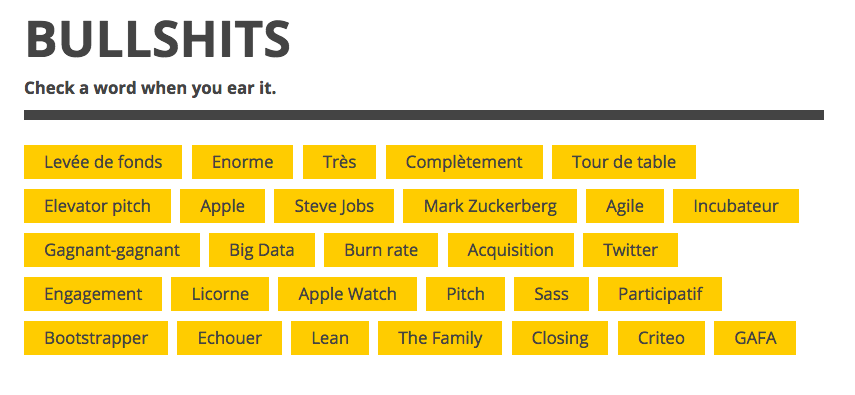
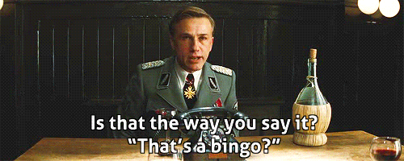
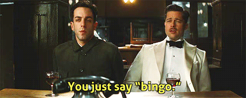

# Bullshit Bingo!

Improving dead boring conferences,
with a point-and-click game app.



Based on [Angular2 quickstart](https://github.com/angular/quickstart)

### Install

```bash
git clone git@github.com:ronanguilloux/BullshitBingo.git
git clone https://github.com/ronanguilloux/BullshitBingo.git
cd BullshitBingo
npm install http-server -g
http-server
```

Then open [http://localhost:8080](http://localhost:8080).

### Current state:

POC, WIP!




